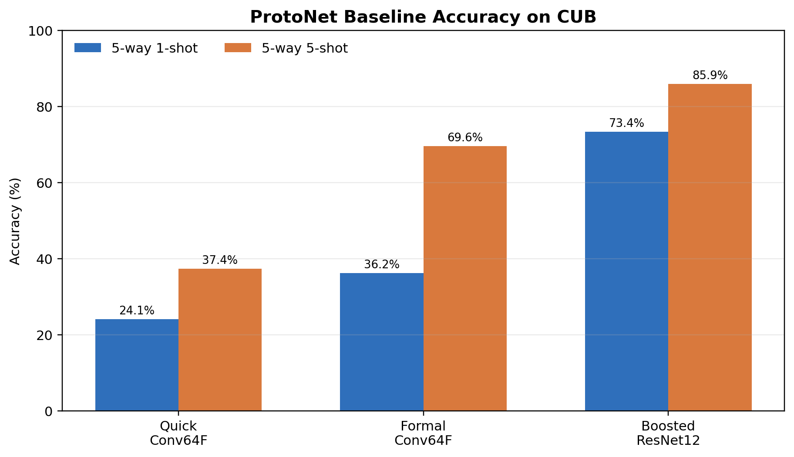
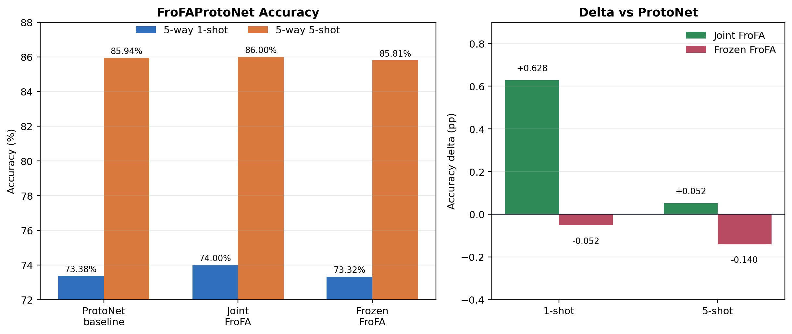
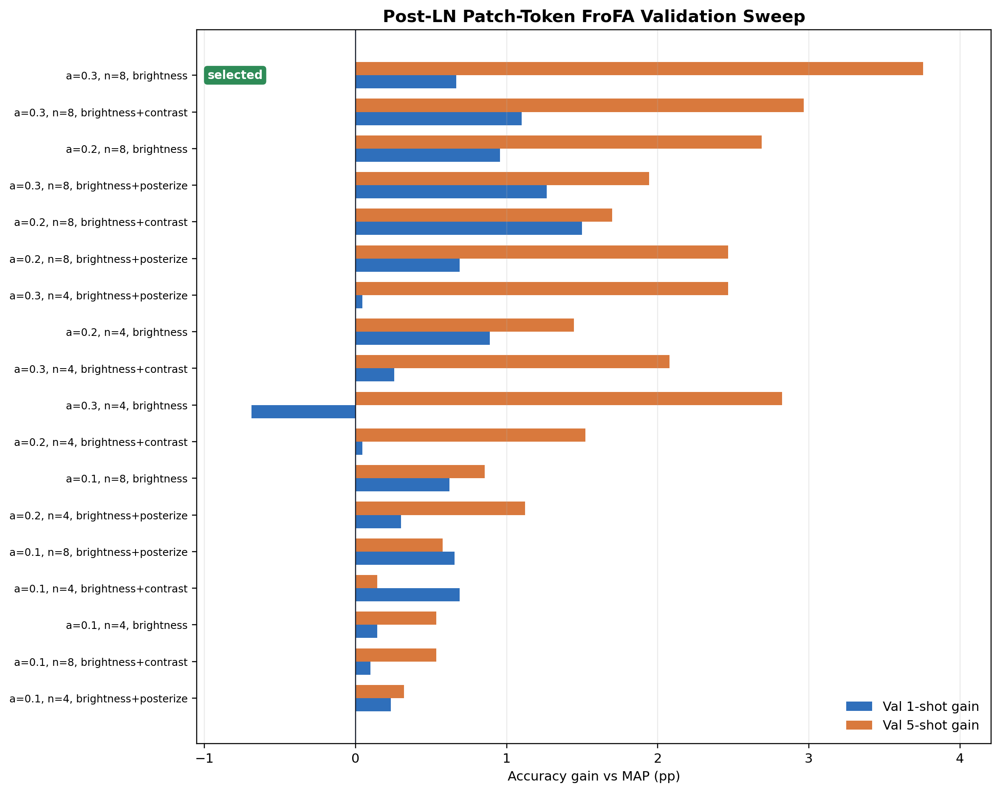
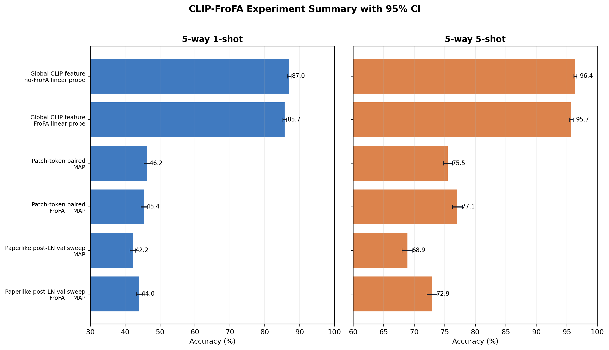

# 基于 Frozen Feature Augmentation 的小样本细粒度图像分类实验报告

## 摘要

本项目围绕细粒度图像小样本分类任务展开，目标是在统一的 CUB few-shot classification 设置下，建立可复查的 ProtoNet baseline，复现 Frozen Feature Augmentation for Few-Shot Image Classification（FroFA, CVPR 2024）的核心思想，并进一步探索更强 frozen representation 与 patch-token feature augmentation 对小样本分类性能的影响。

实验以 LibFewShot 为基础框架，首先在 CUB 数据集上完成 ProtoNet + Conv64F 与 ProtoNet + ResNet12 baseline。结果表明，训练规模和 backbone 表达能力对 CUB few-shot 分类影响显著：快速 Conv64F baseline 在 5-way 1-shot / 5-shot 上仅达到 24.133% / 37.413%，正式 Conv64F baseline 提升到 36.249% / 69.584%，而 ResNet12 增强 baseline 达到 73.376% / 85.945%，成为后续复现和改进实验的主对照。

在 FroFA 复现实验中，本项目将 FroFA-style support feature augmentation 接入 LibFewShot 的 episodic ProtoNet 流程，新增 `FroFAProtoNet`。joint FroFA 在 ResNet12 上取得 74.004% / 85.997%，相对 ResNet12 baseline 分别提升 0.628 和 0.052 个百分点；frozen ResNet12 FroFA 为 73.324% / 85.805%，略低于 baseline。该阶段说明 FroFA 思路可以接入传统 episodic pipeline，但如果 frozen feature 来自任务内训练的 ResNet12，而不是大规模预训练 ViT，收益并不稳定。

为进一步贴近 FroFA 原论文假设，本项目设计了 CLIP-FroFA 改进实验：使用 frozen CLIP ViT-B/16 提取 global features、projected patch tokens 和 projection 之前的 post-LN patch tokens，并在缓存特征上训练轻量 linear probe 或 MAP head。实验发现，global CLIP feature 本身已经非常强，no-FroFA linear probe 达到 86.975 +/- 0.569 / 96.379 +/- 0.248，明显超过任务内训练的 ResNet12 baseline；但在 pooled global embedding 上直接做 FroFA 会降低性能。相比之下，patch-token 路线更符合 FroFA 原始设定。最终 paperlike 路线使用 CLIP ViT-B/16 post-LN patch tokens、validation split 选择超参，并在 test split 上汇报：MAP baseline 为 42.187 +/- 0.816 / 68.878 +/- 0.884，FroFA + MAP 达到 43.960 +/- 0.854 / 72.893 +/- 0.833，分别提升 1.773 和 4.016 个百分点。

综合来看，本项目完成了从传统 ProtoNet baseline、FroFA 框架内复现，到 CLIP frozen patch-token 改进的完整实验链路。最终结论是：强预训练 frozen representation 是 FroFA 能否发挥作用的关键前提；FroFA 更适合应用在保留空间结构的 ViT patch-token grid 上，而不适合直接作用在压缩后的 global embedding 上；在 validation-selected post-LN patch-token 设置中，brightness FroFA 可以稳定提升 MAP head，尤其在 5-shot 场景下收益更明显。

关键词：小样本学习；细粒度图像分类；CUB；ProtoNet；LibFewShot；FroFA；Frozen Feature；CLIP；ViT；Patch Token；MAP Head

## 1. 研究背景与任务定义

### 1.1 小样本图像分类

小样本学习关注在每个类别只有少量标注样本时完成新类别识别的问题。典型 few-shot classification 通常采用 episodic evaluation：每个 episode 从若干类别中采样 support set 和 query set，模型利用 support set 建立当前 episode 的分类器，再在 query set 上评估准确率。

本项目使用的主要设定为：

| 术语 | 含义 |
|---|---|
| `N-way` | 每个 episode 中包含 `N` 个类别 |
| `K-shot` | 每个类别在 support set 中提供 `K` 个标注样本 |
| `query` | 每个类别用于测试的 query 样本数 |
| `support set` | 当前 episode 的少量带标签训练样本 |
| `query set` | 当前 episode 的测试样本 |
| `episode` | 一次小样本分类任务采样与评估单元 |

本项目的所有主实验均采用 `5-way` 设置，并分别评估 `1-shot` 和 `5-shot`。每类 query 数为 15，因此每个 episode 的 query set 总量为 75 张图像。

### 1.2 细粒度图像分类与 CUB 数据集

实验数据集为 CUB，即鸟类细粒度分类数据。细粒度分类的难点在于类别间视觉差异较小，模型不仅需要识别整体轮廓，还需要捕捉局部纹理、颜色、羽毛、喙、翅膀等细节差异。相比通用物体分类，CUB 更能检验特征表示的判别能力，也更适合观察 patch-token 层面的局部信息是否有助于少样本识别。

项目要求 CUB 数据以 LibFewShot 风格组织：

```text
data/CUB_200_2011/
├─ images/
├─ train.csv
├─ val.csv
└─ test.csv
```

其中 `train.csv`、`val.csv`、`test.csv` 记录图像路径和类别名称。真实图像数据不进入 Git，项目只保留 `data/.gitkeep` 占位文件。

### 1.3 项目目标

本项目的目标可以拆为三个层次：

1. 建立可复现 baseline：基于 LibFewShot 在 CUB 上跑通 ProtoNet 训练、测试、日志和结果汇总流程。
2. 复现 FroFA 思路：将特征空间增强接入 episodic few-shot pipeline，并与 ProtoNet baseline 对比。
3. 设计改进路线：引入 CLIP ViT-B/16 frozen representation，比较 global feature、patch token、post-LN token 等不同特征形式下 FroFA 的有效性。

项目最终希望回答的问题是：

- FroFA-style feature augmentation 是否能在 CUB few-shot classification 中带来提升？
- FroFA 在传统 task-trained ResNet12 feature 上是否稳定有效？
- 使用 CLIP frozen feature 后，global embedding 与 patch-token grid 哪一种更适合 FroFA？
- validation-selected patch-token FroFA 是否能在 test split 上取得可靠正收益？

## 2. 相关方法与论文基础

### 2.1 ProtoNet

ProtoNet 是典型 metric-based few-shot learning 方法。给定一个 episode，模型先使用 backbone 提取 support 和 query 图像特征。对每个类别，ProtoNet 将该类 support 特征求平均，得到类别原型 `prototype`。随后根据 query 特征到各类别原型的距离进行分类。

在欧氏距离设置下，类别 `c` 的 prototype 可写为：

```text
p_c = mean({ f(x_i) | y_i = c, x_i in support set })
```

query 样本 `x_q` 对类别 `c` 的 logit 通常为负距离：

```text
logit_c = - || f(x_q) - p_c ||^2
```

ProtoNet 结构简单、稳定、可解释性强，因此适合作为 few-shot 实验的主 baseline。

### 2.2 FroFA 原论文思想

FroFA 的全称是 Frozen Feature Augmentation。原论文关注的问题是：当下游任务只训练冻结大模型特征之上的轻量分类头时，能否不回到图像空间重新运行大模型，而是直接在缓存后的 frozen feature space 中做数据增强？

FroFA 的基本流程为：

```text
image
-> frozen pretrained ViT
-> cached patch features
-> feature-space augmentation
-> lightweight head training
-> few-shot classification
```

其核心操作可以概括为：

```text
feature
-> min-max normalize to [0, 1]
-> apply image-style augmentation in feature space
-> inverse min-max transform
-> augmented feature
```

原论文比较了多种增强方式，发现几何增强在 frozen patch feature 上通常效果较差，而 brightness、contrast、posterize 等逐点风格增强更有效。其中 brightness c2FroFA 的表现最稳定：增强参数按通道采样，min-max 映射也按通道统计。这说明 FroFA 的关键不只是“增加样本数量”，而是以较小扰动改善少样本轻量头对 frozen feature 分布的泛化。

### 2.3 本项目对 FroFA 的复现范围

受项目资源和框架条件限制，本项目没有完整复现原论文在多个预训练模型、多个数据集和多种 shot 数上的大规模实验，而是选择了一个可完成且可验证的复现范围：

- 数据集固定为 CUB。
- few-shot 评估固定为 5-way 1-shot 与 5-way 5-shot。
- 第一阶段使用 LibFewShot 中的 ProtoNet + ResNet12 作为主对照。
- 第二阶段在 LibFewShot 内新增 `FroFAProtoNet`，对 support features 做 FroFA-style augmentation。
- 第三阶段引入 frozen CLIP ViT-B/16，并在 cached global features 或 patch tokens 上训练轻量分类头。
- 在最接近原论文的路线中，使用 post-LN patch tokens、validation sweep 和 test split 汇报，避免直接用 test 结果调参。

因此，本项目更准确的定位是：在 CUB few-shot setting 下复现 FroFA 的关键机制，并通过 CLIP patch-token 路线验证 FroFA 原论文假设在项目条件下是否成立。

## 3. 项目结构与实现概览

### 3.1 仓库结构

项目目录按环境、数据、第三方框架、配置、脚本、实验记录和报告材料划分：

```text
.
├── environment/       # Python/Conda 依赖与环境说明
├── data/              # 本地数据集挂载目录；Git 仅保留占位文件
├── third_party/       # LibFewShot 框架代码和项目内改动说明
├── configs/           # Baseline 与 FroFA 的 LibFewShot YAML 配置
├── scripts/           # Baseline、FroFA、CLIP-FroFA 的运行入口
├── experiments/       # 每条实验线的说明文档和可提交 CSV 结果
├── docs/              # 项目计划、论文笔记和论文 PDF
├── report/            # 最终报告、图表、表格和展示材料
├── demo/              # 项目演示检查清单和辅助入口
└── artifacts/         # 日志、checkpoint、feature cache、预训练权重等本地产物
```

其中 `experiments/*/results/` 保存可提交的小型 CSV 汇总；`artifacts/` 保存日志、checkpoint、特征缓存和预训练权重等可再生成或体积较大的本地产物，默认不纳入 Git。

### 3.2 环境依赖

项目依赖集中维护在 `environment/requirements.txt`。核心依赖包括：

| 类别 | 依赖 |
|---|---|
| 数值计算 | `numpy`, `pandas`, `scipy`, `scikit-learn` |
| 图像与配置 | `Pillow`, `PyYAML`, `matplotlib` |
| LibFewShot 辅助 | `einops`, `future`, `rich`, `tensorboard` |
| 深度学习 | `torch`, `torchvision` |
| CLIP 实验 | `open_clip_torch` |

推荐使用 Conda 或 Miniconda 创建环境，并在项目根目录执行：

```bash
pip install -r environment/requirements.txt
```

### 3.3 LibFewShot 改动

本项目将 LibFewShot 作为训练与评估内核。主要新增或修改如下：

| 文件 | 作用 |
|---|---|
| `third_party/LibFewShot/core/model/metric/frofa_proto_net.py` | 新增 `FroFAProtoNet`，实现 support feature augmentation + ProtoNet classification |
| `third_party/LibFewShot/config/classifiers/FroFAProto.yaml` | 新增 FroFAProtoNet classifier 默认参数 |
| `third_party/LibFewShot/config/frofa_proto.yaml` | 新增 FroFAProtoNet 示例配置 |
| `third_party/LibFewShot/core/model/metric/__init__.py` | 注册 `FroFAProtoNet` |
| `third_party/LibFewShot/core/trainer.py` | 做单卡/CPU 设备兼容性调整 |

`FroFAProtoNet` 的核心步骤为：

1. 提取 support/query features。
2. 将 support features 按 episode、way、shot 组织。
3. 对 support features 做 min-max normalization。
4. 在 `[0, 1]` 特征空间应用 `brightness`、`contrast`、`posterize` 等增强。
5. 将增强结果映射回原始特征尺度。
6. 将原始 support features 与增强 support features 一起计算 class prototypes。
7. 使用 ProtoNet 风格距离对 query features 分类。

该实现支持：

- `augmentations`：增强类型列表。
- `alpha`：增强强度。
- `num_aug`：每类 support feature 的增强次数。
- `distance`：`euclidean` 或 `cos_sim`。
- `freeze_emb_func`：是否冻结 backbone。
- `learnable_scale`：是否学习 logits scale。

### 3.4 CLIP-FroFA 改进实现

CLIP-FroFA 改进实验不直接依赖 LibFewShot trainer，而是使用独立脚本在缓存特征上采样 episode 并训练轻量头。这样可以更接近 FroFA 原论文的 frozen feature workflow。

主要脚本如下：

| 脚本 | 功能 |
|---|---|
| `scripts/clip_frofa/extract_clip_features.py` | 使用 frozen CLIP ViT-B/16 提取 pooled global image features |
| `scripts/clip_frofa/extract_clip_patch_tokens.py` | 使用 frozen CLIP ViT-B/16 提取 ViT patch tokens |
| `scripts/clip_frofa/run_frofa_linear_eval.py` | 在 global feature 上比较 no-FroFA 与 FroFA linear probe |
| `scripts/clip_frofa/run_frofa_map_eval.py` | 在 patch tokens 上比较 MAP 与 FroFA + MAP |
| `scripts/clip_frofa/run_frofa_map_sweep.py` | 在 val split 上搜索 FroFA/MAP 超参，并用最佳配置评测 test split |

CLIP patch-token 提取支持三种 token stage：

| token stage | 说明 |
|---|---|
| `pre_ln` | CLIP ViT transformer 输出后、`ln_post` 之前的 patch tokens |
| `post_ln` | `ln_post` 之后、projection 之前的 patch tokens |
| `post_proj` | CLIP projection 之后的 patch tokens |

本项目最终主结果使用 `post_ln`，因为它保留 projection 之前的 `N x 196 x 768` patch-token grid，更接近 FroFA 原论文中 frozen ViT feature grid 的设定。

## 4. 实验设计

### 4.1 总体实验路线

本项目按递进方式组织实验：

1. Baseline 实验：验证 LibFewShot 流程，并得到正式 ProtoNet 对照。
2. FroFA 复现实验：将 FroFA-style augmentation 接入 ProtoNet episodic training。
3. CLIP-FroFA 改进实验：引入 frozen CLIP ViT-B/16，比较 global feature 与 patch-token feature。
4. Paperlike validation sweep：在 val split 选择 FroFA 超参，再在 test split 汇报最终结果。

这种设计可以逐步回答“方法能否运行”“是否优于传统 baseline”“为什么收益有限”“如何更贴近原论文假设”等问题。

### 4.2 通用评估设置

所有主实验采用：

| 项目 | 设置 |
|---|---|
| 数据集 | CUB |
| 分类任务 | 5-way few-shot classification |
| shot | 1-shot, 5-shot |
| query per class | 15 |
| 随机种子 | `12` |
| 主要指标 | mean Acc@1 |
| CLIP 实验置信区间 | 95% confidence interval |

Baseline 与 LibFewShot 内 FroFA 使用 LibFewShot episodic trainer 和 tester；CLIP-FroFA 使用缓存特征上的 episode sampling、linear probe 或 MAP head。

### 4.3 Baseline 设置

Baseline 实验分为三层：

| 实验层级 | 方法 | Backbone | 训练设置 | 测试 episodes | 作用 |
|---|---|---|---|---:|---|
| 快速 baseline | ProtoNet | Conv64F | 10 epochs; 100 train episodes/epoch | 100 | 验证链路 |
| Conv64F 正式 baseline | ProtoNet | Conv64F | 100 epochs; 1000 train episodes/epoch | 600 | 轻量 backbone 对照 |
| ResNet12 增强 baseline | ProtoNet | ResNet12 | 120 epochs; 2000 train episodes/epoch | 1000 | 主对照 |

ResNet12 增强 baseline 的关键配置包括：

| 参数 | 值 |
|---|---|
| `image_size` | 84 |
| `augment` | True |
| `way_num` / `test_way` | 5 |
| `shot_num` / `test_shot` | 1 或 5 |
| `query_num` / `test_query` | 15 |
| `episode_size` | 4 |
| `train_episode` | 2000 |
| `test_episode` | 1000 |
| `epoch` | 120 |
| `optimizer` | Adam |
| `lr` | 0.001 |
| `weight_decay` | 0.0005 |
| `lr_scheduler` | StepLR, step_size 20, gamma 0.5 |

### 4.4 FroFA 复现实验设置

FroFA 复现实验固定使用 CUB、5-way 1-shot / 5-shot、ResNet12 backbone，并与 ResNet12 ProtoNet baseline 比较。

| 设置 | 方法 | Backbone | 训练设置 | 测试 episodes | 说明 |
|---|---|---|---|---:|---|
| baseline | ProtoNet | ResNet12 | 120 epochs; 2000 train episodes/epoch | 1000 | 主对照 |
| joint FroFA | FroFAProtoNet | ResNet12 | 120 epochs; 2000 train episodes/epoch | 1000 | backbone 与 FroFAProtoNet 端到端训练 |
| frozen FroFA | FroFAProtoNet | frozen ResNet12 | 30 epochs; 2000 train episodes/epoch | 1000 | 加载 baseline backbone 并冻结 |

`FroFAProtoNet` 关键参数为：

| 参数 | 值 |
|---|---|
| `augmentations` | `brightness`, `contrast` |
| `alpha` | 0.2 |
| `num_aug` | 2 |
| `distance` | `euclidean` |
| `learnable_scale` | True |
| `freeze_emb_func` | joint 为 False，frozen 为 True |

frozen FroFA 使用 baseline 训练得到的 `emb_func_best.pth` 作为 backbone 初始权重，并通过 optimizer 的 `other: emb_func: ~` 避免更新特征提取器。

### 4.5 CLIP-FroFA 改进实验设置

CLIP-FroFA 改进实验分为三条路线：

#### 4.5.1 Global CLIP Feature + Linear Probe

该路线使用 frozen CLIP ViT-B/16 提取 pooled global image features，随后在每个 5-way episode 上训练 closed-form L2 linear classifier。

| 项目 | 设置 |
|---|---|
| Backbone | CLIP ViT-B/16 |
| Feature | pooled global feature |
| Classifier | closed-form L2 linear probe |
| Episodes | 1000 |
| Ridge lambda | 1.0 |
| FroFA alpha | 0.20 |
| FroFA num_aug | 8 |
| Augmentation | brightness |

该路线用于验证强 frozen global representation 是否有效，并检验直接在压缩后的全局向量上做 FroFA 是否合理。

#### 4.5.2 Projected Patch Tokens + MAP Head

该路线提取 CLIP ViT-B/16 projected patch tokens，得到 `N x 196 x 512` token grid。每个 episode 单独训练一个 MAP classifier，并比较不增强 MAP 与 FroFA + MAP。

| 项目 | 设置 |
|---|---|
| Token shape | `N x 196 x 512` |
| Head | episode-trained MAP head |
| Episodes | 600 |
| MAP heads | 8 |
| MAP queries | 1 |
| Train steps | 80 |
| Optimizer | AdamW |
| Learning rate | 0.001 |
| Weight decay | 0.01 |
| FroFA alpha | 0.20 |
| FroFA num_aug | 8 |
| Augmentation | brightness |
| Paired episodes | enabled |

paired episodes 表示同一 shot 下 MAP 与 FroFA + MAP 使用相同 support/query episode，以降低 episode 采样差异导致的随机波动。

#### 4.5.3 Post-LN Patch Tokens + Validation Sweep

最终主结果使用更接近原论文的 paperlike 路线：

```text
CUB images
-> frozen CLIP ViT-B/16
-> post-LN patch tokens, N x 196 x 768
-> validation sweep
-> best FroFA/MAP config
-> test split evaluation
```

validation sweep 搜索空间为：

| 参数 | 搜索值 |
|---|---|
| `alpha` | 0.10, 0.20, 0.30 |
| `num_aug` | 4, 8 |
| `augmentation_sets` | `brightness`, `brightness+posterize`, `brightness+contrast` |
| `train_steps` | 40 |
| `weight_decay` | 0.01 |
| `select_by` | mean gain |

验证集每组配置运行 120 episodes；最终 test split 使用 600 episodes。validation 选出的最佳配置为：

| 参数 | 最佳值 |
|---|---|
| `alpha` | 0.30 |
| `num_aug` | 8 |
| `augmentations` | `brightness` |
| `train_steps` | 40 |
| `weight_decay` | 0.01 |

## 5. 实验结果

### 5.1 ProtoNet Baseline 结果

| 实验层级 | 方法 | Backbone | 5-way 1-shot | 5-way 5-shot |
|---|---|---|---:|---:|
| 快速 baseline | ProtoNet | Conv64F | 24.133% | 37.413% |
| Conv64F 正式 baseline | ProtoNet | Conv64F | 36.249% | 69.584% |
| ResNet12 增强 baseline | ProtoNet | ResNet12 | 73.376% | 85.945% |



图 1 展示了三组 ProtoNet baseline 在 1-shot 与 5-shot 下的准确率变化。整理版表格见 [`baseline_results.md`](../tables/baseline_results.md)。

从结果可以得到三个观察：

第一，快速 baseline 的主要价值是验证链路，而不是作为正式对照。它的训练规模只有 10 epochs、100 train episodes/epoch、100 test episodes，结果明显偏低。

第二，增加训练规模后，Conv64F 正式 baseline 相比快速 baseline 有明显提升。1-shot 从 24.133% 提升到 36.249%，提升 12.116 个百分点；5-shot 从 37.413% 提升到 69.584%，提升 32.171 个百分点。这说明 CUB few-shot 任务对训练 episode 数和测试 episode 数较敏感。

第三，ResNet12 带来最显著提升。相对 Conv64F 正式 baseline，ResNet12 在 1-shot 上提升 37.127 个百分点，在 5-shot 上提升 16.361 个百分点。更强 backbone 对细粒度分类非常重要，因为它能提取更有判别力的局部与语义特征。

因此，后续 FroFA 复现实验采用 ResNet12 增强 baseline 作为主对照。

### 5.2 FroFAProtoNet 复现实验结果

| 方法 | 数据集 | 5-way 1-shot | 5-way 5-shot | 相对 baseline |
|---|---|---:|---:|---|
| ProtoNet-ResNet12 baseline | CUB | 73.376% | 85.945% | baseline |
| FroFAProtoNet-ResNet12 | CUB | 74.004% | 85.997% | 1-shot +0.628; 5-shot +0.052 |
| FroFAProtoNet-ResNet12 frozen | CUB | 73.324% | 85.805% | 1-shot -0.052; 5-shot -0.140 |



图 2 同时给出 FroFAProtoNet 的准确率和相对 ProtoNet-ResNet12 baseline 的增益。整理版表格见 [`frofa_reproduction_results.md`](../tables/frofa_reproduction_results.md)。

joint FroFA 在 1-shot 和 5-shot 上均略高于 ProtoNet-ResNet12 baseline。其中 1-shot 提升 0.628 个百分点，说明 support feature augmentation 在 support 样本极少时确实可能改善 prototype estimation；5-shot 只提升 0.052 个百分点，基本接近持平。

frozen FroFA 略低于 baseline。这个结果与 FroFA 原论文的直觉并不矛盾，因为该设置中的 frozen feature 并不是大规模预训练 ViT 产生的通用 frozen feature，而是 CUB episodic baseline 训练得到的 ResNet12 feature。它更像“冻结一个任务内训练 backbone 后再对 support features 做扰动”，而不是“在强预训练 frozen feature space 上训练轻量头”。因此，冻结本身没有带来更强的可迁移特征空间，FroFA 收益有限。

该阶段的核心结论是：本项目成功将 FroFA-style feature augmentation 接入 LibFewShot 的 ProtoNet pipeline，但传统 task-trained ResNet12 不是 FroFA 最理想的载体。后续应转向更强的 frozen pretrained representation。

### 5.3 Global CLIP Feature 消融结果

| Experiment | Method | 5-way 1-shot | 5-way 5-shot | Main conclusion |
|---|---|---:|---:|---|
| Global CLIP feature | no-FroFA linear probe | 86.975 +/- 0.569 | 96.379 +/- 0.248 | Strong frozen feature baseline |
| Global CLIP feature | FroFA linear probe | 85.717 +/- 0.574 | 95.733 +/- 0.295 | Pooled embedding FroFA hurts |

该结果说明 CLIP ViT-B/16 的 frozen global feature 对 CUB few-shot 分类非常强。与 ResNet12 ProtoNet baseline 的 73.376% / 85.945% 相比，global CLIP no-FroFA linear probe 达到 86.975% / 96.379%，分别提升 13.599 和 10.434 个百分点。

但是，FroFA 直接作用在 pooled global embedding 上会降低性能：1-shot 下降 1.258 个百分点，5-shot 下降 0.646 个百分点。原因可能有三点：

1. global embedding 已经压缩了空间结构，不再保留 patch grid。
2. FroFA 原论文强调的是 ViT patch feature 上的局部/通道扰动，而不是单个全局向量扰动。
3. 对归一化后的 512 维全局语义向量做 brightness-style 加法，可能破坏 CLIP 表征中已经学到的方向和距离结构。

因此，global CLIP feature 证明“强 frozen representation 很重要”，但也证明“FroFA 需要合适的特征形态”。

### 5.4 Projected Patch-Token MAP 结果

| Experiment | Method | 5-way 1-shot | 5-way 5-shot | Main conclusion |
|---|---|---:|---:|---|
| Patch-token paired | MAP | 46.213 +/- 0.875 | 75.478 +/- 0.765 | Patch-token MAP baseline |
| Patch-token paired | FroFA + MAP | 45.402 +/- 0.890 | 77.056 +/- 0.819 | FroFA improves 5-shot by +1.578 |

projected patch-token 路线将特征从 global embedding 改为 `N x 196 x 512` token grid，并使用 episode-trained MAP head。此时 FroFA + MAP 在 5-shot 上从 75.478% 提升到 77.056%，提升 1.578 个百分点；但在 1-shot 上从 46.213% 降到 45.402%，下降 0.811 个百分点。

这个结果具有两层意义：

第一，patch-token 特征比 global embedding 更适合作为 FroFA 的作用对象。虽然整体 MAP baseline 不如 global linear probe，但 FroFA 在 5-shot 上已经出现正收益。

第二，MAP head 在 1-shot 下训练样本极少，每个 episode 只有 5 个 support 样本。此时 attention pooling classifier 的优化不稳定，增强强度、训练步数、weight decay 和 token stage 都可能影响结果。因此，不能只根据 projected patch-token 的 1-shot 负结果否定 FroFA，而应进一步采用 validation sweep。

### 5.5 Post-LN Patch-Token Validation Sweep 结果

validation sweep 的目标是在 test 之前选择 FroFA 超参。核心结果如下：

| Stage | Shot | Alpha | Num aug | Augmentation | MAP | FroFA + MAP | Gain |
|---|---:|---:|---:|---|---:|---:|---:|
| val | 1 | 0.30 | 8 | brightness | 41.511 | 42.178 | +0.667 |
| val | 5 | 0.30 | 8 | brightness | 67.278 | 71.033 | +3.756 |
| test | 1 | 0.30 | 8 | brightness | 42.187 | 43.960 | +1.773 |
| test | 5 | 0.30 | 8 | brightness | 68.878 | 72.893 | +4.016 |



图 3 汇总了 post-LN patch-token 路线在 validation split 上不同 FroFA 配置的增益，标注出的 `selected` 配置即最终用于 test split 的配置。最佳配置的整理版结果见 [`postln_selected_config_results.md`](../tables/postln_selected_config_results.md)。

最终 test split 详细结果为：

| Experiment | Method | 5-way 1-shot | 5-way 5-shot | Gain |
|---|---|---:|---:|---:|
| Paperlike post-LN val sweep | MAP | 42.187 +/- 0.816 | 68.878 +/- 0.884 | baseline |
| Paperlike post-LN val sweep | FroFA + MAP | 43.960 +/- 0.854 | 72.893 +/- 0.833 | +1.773 / +4.016 |

这是本项目最重要的正结果。与 projected patch-token 实验相比，paperlike 路线有三点改进：

1. 使用 projection 之前的 `post_ln` patch tokens，形状为 `N x 196 x 768`，更接近 FroFA 原论文的 frozen ViT feature grid。
2. 使用 validation split 选择 `alpha`、`num_aug` 和 augmentation set，避免直接根据 test split 调参。
3. 测试阶段只使用 validation 选出的最佳配置，并在 test split 上汇报。

最终结果说明，在更合适的 frozen feature representation 和更规范的超参选择流程下，brightness FroFA 能稳定提升 MAP head，尤其在 5-shot 上提升达到 4.016 个百分点。

### 5.6 三阶段实验结果汇总

| 阶段 | 代表方法 | 5-way 1-shot | 5-way 5-shot | 结论 |
|---|---|---:|---:|---|
| Baseline | ProtoNet + ResNet12 | 73.376% | 85.945% | 传统 episodic backbone 主对照 |
| LibFewShot FroFA | FroFAProtoNet + ResNet12 | 74.004% | 85.997% | 可接入 pipeline，但提升很小 |
| Frozen global feature | CLIP global + linear probe | 86.975 +/- 0.569 | 96.379 +/- 0.248 | 强 frozen representation 极有效 |
| Global feature FroFA | CLIP global + FroFA linear probe | 85.717 +/- 0.574 | 95.733 +/- 0.295 | pooled embedding 上 FroFA 伤害性能 |
| Patch-token FroFA | projected patch tokens + FroFA MAP | 45.402 +/- 0.890 | 77.056 +/- 0.819 | patch-token 上 5-shot 有提升 |
| Paperlike FroFA | post-LN patch tokens + val-selected FroFA MAP | 43.960 +/- 0.854 | 72.893 +/- 0.833 | 更接近原论文设置，1-shot/5-shot 均提升 |



图 4 汇总了 CLIP-FroFA 三条路线的 1-shot 与 5-shot 准确率，并展示 95% confidence interval。整理版表格见 [`clip_frofa_final_summary.md`](../tables/clip_frofa_final_summary.md)。

需要注意，CLIP global linear probe 与 patch-token MAP 的数值不能直接解释为同一 head 的优劣，因为它们的特征形式、分类头、优化方式和实验目的不同。global linear probe 是强 frozen baseline；patch-token MAP 是为了检验 FroFA 是否能在保留空间结构的 token grid 上发挥作用。最终报告应把 paperlike FroFA 的增益作为 FroFA 机制有效性的主证据，而不是把它与 global linear probe 直接竞争。

## 6. 结果分析与讨论

### 6.1 Backbone 能力对 CUB few-shot 至关重要

Baseline 阶段最明显的现象是 ResNet12 远强于 Conv64F。Conv64F 正式 baseline 在 5-shot 上已经达到 69.584%，但 1-shot 仍只有 36.249%；更换 ResNet12 后，1-shot 提升到 73.376%，说明特征提取器质量是细粒度小样本分类的核心因素。

CUB 类别间差异细微，如果 backbone 无法提取足够判别的局部细节，即使 ProtoNet 的 episode 训练流程正确，最终准确率也会受限。这也是后续引入 CLIP ViT-B/16 的直接动机。

### 6.2 FroFA 在传统 episodic ResNet12 上收益有限

`FroFAProtoNet` 在 joint 设置中取得小幅提升，但 frozen 设置没有提升。这说明 FroFA 并不是简单地“多造 support 样本就一定提升”。它依赖 feature space 本身具有良好的语义结构和可扰动性。

任务内训练的 ResNet12 特征与原论文中大规模预训练 ViT frozen feature 不同：

- ResNet12 主要为当前 CUB episodic training 优化，不一定形成通用、平滑的 frozen feature manifold。
- LibFewShot 内的 `FroFAProtoNet` 对 flatten features 做增强，没有完整保留 ViT patch grid 的空间结构。
- 原型分类对 support mean 较敏感，过强或不合适的扰动可能抵消增强收益。

因此，传统 ResNet12 setting 更适合证明实现链路可行，而不是作为 FroFA 原论文结论的最强验证。

### 6.3 Global CLIP feature 强，但不适合直接做 FroFA

CLIP global linear probe 是所有实验中准确率最高的路线，说明大规模视觉-语言预训练学到的 global representation 对 CUB 少样本分类非常有效。尤其在 5-shot 上达到 96.379%，表明简单 closed-form linear classifier 已经能够很好地区分类别。

然而，global FroFA 下降说明压缩后的 global embedding 并不适合套用 image-style augmentation。FroFA 原论文的关键不是“任意特征都能增强”，而是“保留 patch 结构的 frozen ViT features 可以经过通道级、逐点式扰动改善轻量头训练”。global embedding 已经把图像局部结构聚合进单个向量，直接 min-max 后做 brightness 扰动，可能改变语义方向或破坏 feature normalization 带来的距离性质。

### 6.4 Patch-token grid 是 FroFA 更合理的作用对象

projected patch-token 实验虽然 1-shot 下降，但 5-shot 提升；post-LN paperlike 实验在 1-shot 和 5-shot 上均提升。二者共同说明：FroFA 更适合 patch-token grid，而不是 pooled global vector。

FroFA 在 patch-token 上有效的原因可能包括：

- patch tokens 保留局部空间结构，增强可以模拟局部或通道级外观变化。
- MAP head 需要从 token grid 中学习聚合方式，support augmentation 能改善其训练样本不足的问题。
- brightness c2-style 扰动按通道改变 token feature 分布，能提供比简单复制 support 样本更丰富的训练信号。

在 5-shot 上收益更明显，是因为每个 episode 有更多真实 support 样本，增强样本围绕更可靠的类别局部分布展开；而 1-shot 中每类只有一个真实样本，增强容易围绕单个样本过拟合或引入偏移。

### 6.5 Validation sweep 的必要性

FroFA 对 `alpha`、`num_aug`、token stage、训练步数和 weight decay 都敏感。projected patch-token 实验中固定超参后 1-shot 表现下降，而 paperlike 路线通过 validation split 选择超参后，在 test 上取得正收益。这说明规范的超参选择流程对 FroFA 很重要。

本项目最终选择 `alpha=0.30`、`num_aug=8`、`brightness`、`train_steps=40`、`weight_decay=0.01`。该配置在 validation 上 1-shot 和 5-shot 平均收益较好，并在 test 上继续保持正收益，因此比直接根据 test 调整配置更可信。

### 6.6 与 FroFA 原论文结论的一致性

本项目与原论文一致的发现包括：

- frozen feature augmentation 在合适表示上可以改善少样本分类。
- brightness 是稳定有效的增强类型。
- patch-token feature 比 global vector 更符合 FroFA 假设。
- 超低样本场景中增强收益与不稳定性并存，需要验证集选择。
- 不是所有增强都适合特征空间；增强位置和特征形态非常关键。

与原论文不同或简化的地方包括：

- 本项目数据集固定为 CUB，没有覆盖原论文中的多个迁移数据集。
- 本项目使用 CLIP ViT-B/16，而不是原论文中的 JFT-3B/ImageNet-21k/WebLI + SigLIP 多种预训练来源组合。
- MAP head 实现是项目内轻量 episode-trained 版本，与原论文完整训练协议不同。
- 本项目主要比较 1-shot 和 5-shot，没有覆盖 10-shot、25-shot。
- LibFewShot 内复现使用 ResNet12 flatten feature，不是原论文的 frozen ViT patch features。

这些差异解释了为什么本项目中不同路线的绝对精度和收益幅度不能与原论文主表直接逐项对齐。

## 7. 可复现性说明

### 7.1 推荐运行顺序

从项目根目录执行：

```bash
pip install -r environment/requirements.txt
bash scripts/baseline/run_proto_cub_boost_cloud.sh
bash scripts/frofa/run_frofa_cub_cloud.sh all
bash scripts/clip_frofa/run_patch_frofa_paperlike_cloud.sh
```

如果 CLIP 权重无法自动下载，可先准备本地权重并设置：

```bash
export CLIP_PRETRAINED=artifacts/pretrained/open_clip_model.safetensors
```

### 7.2 Baseline 结果文件

Baseline 结果汇总位于：

```text
experiments/baseline/results/summary_all.csv
```

关键日志包括：

```text
artifacts/logs/baseline/proto_cub_5way_1shot_console.log
artifacts/logs/baseline/proto_cub_5way_5shot_console.log
artifacts/logs/baseline/proto_cub_conv64f_formal_5way_1shot_cloud_console.log
artifacts/logs/baseline/proto_cub_conv64f_formal_5way_5shot_cloud_console.log
artifacts/logs/baseline/proto_cub_resnet12_boost_5way_1shot_cloud_console.log
artifacts/logs/baseline/proto_cub_resnet12_boost_5way_5shot_cloud_console.log
```

### 7.3 FroFA 复现结果文件

FroFA 复现汇总位于：

```text
experiments/frofa_reproduction/results/frofa_vs_baseline_summary.csv
```

单次实验 CSV 位于：

```text
experiments/frofa_reproduction/results/frofa_proto_cub_resnet12_5way_1shot_cloud.csv
experiments/frofa_reproduction/results/frofa_proto_cub_resnet12_5way_5shot_cloud.csv
experiments/frofa_reproduction/results/frofa_proto_cub_resnet12_frozen_5way_1shot_cloud.csv
experiments/frofa_reproduction/results/frofa_proto_cub_resnet12_frozen_5way_5shot_cloud.csv
```

### 7.4 CLIP-FroFA 结果文件

CLIP-FroFA 最终汇总位于：

```text
experiments/clip_frofa_improvement/results/final_summary.csv
```

主要结果文件包括：

```text
experiments/clip_frofa_improvement/results/clip_vit_b16_frofa_linear_cub.csv
experiments/clip_frofa_improvement/results/clip_vit_b16_patch_frofa_map_cub_paired.csv
experiments/clip_frofa_improvement/results/clip_vit_b16_postln_patch_frofa_map_sweep.csv
```

CLIP 特征缓存位于：

```text
artifacts/features/clip_frofa/
```

该目录不纳入 Git，但可以由脚本重新生成。

## 8. 局限性

### 8.1 数据集范围有限

本项目只在 CUB 上实验。CUB 是细粒度鸟类分类数据集，能够体现局部视觉细节的重要性，但不能完全代表通用 few-shot transfer 场景。FroFA 原论文覆盖了更多数据集，因此本项目结论更适合表述为“在 CUB 设置下观察到的现象”。

### 8.2 与原论文训练协议仍有差异

虽然 paperlike 路线已经使用 post-LN patch tokens 和 validation sweep，但 MAP head、episode 采样、训练步数、预训练模型来源等仍与原论文不同。因此本项目不能声称完整复现原论文所有结果，只能说明核心机制在项目设置中得到部分验证。

### 8.3 CLIP global feature 与 patch-token MAP 不宜直接比较

global linear probe 准确率远高于 patch-token MAP，但二者服务于不同问题。global linear probe 主要验证强 frozen representation；patch-token MAP 主要验证 FroFA 在 patch grid 上是否有效。由于分类头和特征形式不同，直接比较绝对精度容易产生误解。

### 8.4 1-shot 场景仍不稳定

在 projected patch-token paired 实验中，FroFA 对 1-shot 有负作用；在 post-LN paperlike 路线中，1-shot 转为正收益。说明 1-shot 对特征层、增强强度和训练超参高度敏感。后续若要得到更稳健结论，应增加随机 split、多 seed 和更多 episodes。

### 8.5 增强组合探索仍有限

本项目主要探索 brightness、brightness+posterize、brightness+contrast。原论文还涉及更多增强方式和顺序组合。本项目没有完整比较几何增强、crop/drop、mixup、RandAugment 或 TrivialAugment 风格组合。

## 9. 后续工作

后续可以从以下方向改进：

1. 增加多 seed 评估，报告均值和置信区间，降低 episode sampling 随机性影响。
2. 扩展到 miniImageNet、tieredImageNet 或其他细粒度数据集，检验 FroFA 在不同数据分布下的泛化性。
3. 更系统地比较 `pre_ln`、`post_ln`、`post_proj` token stage 对 FroFA 的影响。
4. 增加 MAP head 的训练步数、学习率、weight decay、dropout、query token 数等超参搜索。
5. 实现更接近原论文的 brightness c2FroFA，包括更严格的 per-channel min-max 与更完整的增强强度策略。
6. 尝试 sequential FroFA，例如 `brightness -> posterize`，并在 validation split 上选择组合。
7. 与 linear probe、nearest centroid、attention pooling、adapter head 等更多轻量分类头比较。
8. 对增强前后的 patch-token 分布做可视化分析，例如通道统计、类内/类间距离、attention map 变化等。

## 10. 结论

本项目完成了一个较完整的小样本图像分类复现实验流程。首先，基于 LibFewShot 在 CUB 上建立 ProtoNet baseline，并证明训练规模和 backbone 能力对细粒度 few-shot classification 至关重要。其次，本项目实现了 `FroFAProtoNet`，将 FroFA-style support feature augmentation 接入 LibFewShot episodic ProtoNet 流程，在 joint ResNet12 设置下取得轻微提升，但 frozen ResNet12 设置未能稳定超过 baseline，说明传统 task-trained backbone 并不是 FroFA 最合适的载体。

进一步地，本项目引入 CLIP ViT-B/16 frozen features。global CLIP linear probe 显著超过 ResNet12 ProtoNet，说明强预训练 representation 对 CUB few-shot 任务非常有效；但 global embedding 上的 FroFA 反而降低性能，说明 FroFA 不能脱离特征形态使用。最终，项目在 post-LN patch-token grid 上进行 validation-selected FroFA + MAP 实验，在 test split 上取得 1-shot +1.773、5-shot +4.016 个百分点的提升。这一结果支持 FroFA 原论文的核心观点：在冻结的 ViT patch feature space 中进行合适的特征增强，可以改善小样本分类中轻量头的泛化能力。

因此，本项目的最终结论是：FroFA 的有效性依赖强 frozen feature、保留空间结构的 patch-token representation，以及基于 validation 的超参选择。对于 CUB 细粒度小样本分类，CLIP ViT-B/16 post-LN patch tokens + brightness FroFA + MAP head 是本项目中最能体现 FroFA 机制正收益的路线。

## 参考资料与项目依据

本报告主要依据以下项目文件整理：

| 类型 | 路径 |
|---|---|
| 项目说明 | `README.md` |
| 项目计划 | `docs/planning/project_plan.md` |
| 运行手册 | `docs/runbook.md` |
| 环境说明 | `environment/setup_guide.md`, `environment/requirements.txt` |
| 论文笔记 | `docs/notes/paper_notes.md` |
| Baseline 文档 | `experiments/baseline/experiment_summary.md`, `experiments/baseline/run_guide.md` |
| FroFA 复现文档 | `experiments/frofa_reproduction/experiment_summary.md`, `experiments/frofa_reproduction/run_guide.md` |
| CLIP-FroFA 文档 | `experiments/clip_frofa_improvement/experiment_summary.md`, `experiments/clip_frofa_improvement/run_guide.md` |
| Baseline 结果 | `experiments/baseline/results/summary_all.csv` |
| FroFA 结果 | `experiments/frofa_reproduction/results/frofa_vs_baseline_summary.csv` |
| CLIP-FroFA 结果 | `experiments/clip_frofa_improvement/results/final_summary.csv`, `experiments/clip_frofa_improvement/results/clip_vit_b16_postln_patch_frofa_map_sweep.csv` |
| FroFA 实现 | `third_party/LibFewShot/core/model/metric/frofa_proto_net.py` |
| CLIP-FroFA 实现 | `scripts/clip_frofa/*.py` |
| 报告图表生成脚本 | `scripts/report/generate_report_assets.py` |
| 报告图片产物 | `report/figures/*.png` |
| 报告表格产物 | `report/tables/*.md` |

外部论文资料：

- Andreas Baer, Neil Houlsby, Mostafa Dehghani, Manoj Kumar. Frozen Feature Augmentation for Few-Shot Image Classification. CVPR 2024.
- LibFewShot documentation: https://libfewshot-en.readthedocs.io/
